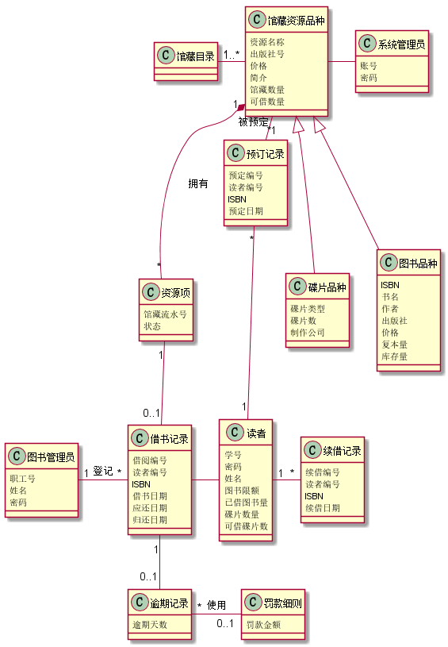
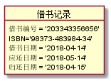
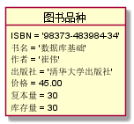
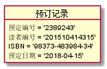
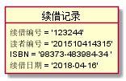

# 实验3：图书管理系统领域对象建模
|学号|班级|姓名|
|:----:|:----:|:----:|
|201510414315|软件（本）15-3|王仕宣|
## 1 图书管理系统的类图
### 1.1 类图PlantUML源码如下：
```
@startuml
class 读者 {
    学号
    密码
    姓名
    图书限额
    已借图书量
    碟片数量
    可借碟片数
}
class 图书管理员 {
   职工号
   姓名
   密码
}
 class 借书记录{
借阅编号
读者编号
ISBN
借书日期
应还日期
归还日期
}
class 预订记录{
预定编号
读者编号
ISBN
预定日期
}
class 逾期记录{
逾期天数
}
class 罚款细则{
罚款金额
}
class 资源项 {
馆藏流水号
状态
}
class 馆藏资源品种 {
资源名称
出版社号
价格
简介
馆藏数量
可借数量
}
class 馆藏目录{
}
class 碟片品种{
碟片类型
碟片数
制作公司
}
class 图书品种{
ISBN
书名
作者
出版社
价格
复本量
库存量
}
class 续借记录{
续借编号
读者编号
ISBN
续借日期
}
class 系统管理员{
账号
密码
}
馆藏资源品种<|--图书品种
馆藏资源品种<|--碟片品种
馆藏目录 "1"-"1..*" 馆藏资源品种
馆藏资源品种"1"-"*"预订记录:被预定
馆藏资源品种"1"*--"*"资源项:拥有
资源项"1"--"0..1"借书记录
预订记录"*"-"1"读者
借书记录-读者
借书记录"1"--"0..1"逾期记录
逾期记录"*"-"0..1"罚款细则:使用
图书管理员"1"-"*"借书记录:登记
读者"1"-"*"续借记录
馆藏资源品种-系统管理员
@enduml
```
### 1.2 类图如下：
 
### 1.3 类图说明：
&nbsp;&nbsp;&nbsp;&nbsp;&nbsp;系统中的主要业务实体类通常需要在数据库中进行存储，
如需要存储图书的信息，就需要一个图书类，<br>图书类是由图书用例产生的。同样，预定用
例确定预定类；借阅用例可以确定 借阅类；对于书目信息的<br>存储需要一个书目类。每一本
图书拥有和其他图书相区别的编号、目录名称编号、ISBN名称、作者名称、<br>出版社 名称、书名
称以及出版日期；借阅书籍时，借阅信息存储书籍的编号、借阅者的编号以及借阅日<br>期；预定
图书信息存储书籍的编号、借阅者的编号以及预定日期；书目信息包含书目的编号和书目的名称。
## 2 图书管理系统的对象图
### 2.1 类reader的对象图
#### 源码如下：
```
@startuml
 object 读者
 读者 : 学号 = '201510414315'(由12为数字字符串组成)
 读者 : 姓名 = '张三'
 读者 : 密码 = '**********'(由8-20位数字字符组成的字符串)
 读者 : 图书限额 = 30
 读者 : 已借图书量 = 3
 读者 : 碟片数量 = 30
 读者 : 可借碟片数 = 30
@enduml
```
#### 对象图如下：

### 2.2 类admin的对象图
#### 源码如下：
```
@startuml
Object 图书管理员
图书管理员 : 职工号 = '201310414345'(12位数字组成)
图书管理员 : 姓名 = '王五'
图书管理员 : 密码 ='**********'(8-20个数字字符组合字符串)
@enduml
```
#### 对象图如下：

### 2.3 类systemAdmin的对象图
#### 源码如下：
```
 @startuml
 Object 系统管理员
 系统管理员 : 账号 = '2393928'(由8位数字组成的数字字符串)
 系统管理员 : 密码 = '*********'(由8-20位数字字符组成的字符串)
 @enduml
```
#### 对象图如下：

### 2.4 类借书记录的对象图
#### 源码如下：
```
@startuml
 Object 借书记录
 借书记录 : 借书编号 = '203343356656'
 借书记录 : ISBN='98373-483984-34'
 借书记录 : 借书日期 = '2018-04-14'
 借书记录 : 应还日期 = '2018-05-14'
 借书记录 : 归还日期 = '2018-04-15'
@enduml
```

#### 对象图如下：

### 2.5 类图书品种的对象图
#### 源码如下：
```
@startuml
Object 图书品种
图书品种 : ISBN = '98373-483984-34'
图书品种 : 书名 = '数据库基础'
图书品种 : 作者 = '崔伟'
图书品种 : 出版社 = '清华大学出版社'
图书品种 : 价格 = 45.00
图书品种 : 复本量 = 30
图书品种 : 库存量 = 30
@enduml
```

#### 对象图如下：

### 2.6 类预定记录的对象图
#### 源码如下：
```
@startuml
  Object 预订记录
  预订记录 : 预定编号 = '2389243'
  预订记录 : 读者编号 = '201510414315'
  预订记录 : ISBN = '98373-483984-34'
  预订记录 : 预定日期 = '2018-04-15'
 @enduml

```
#### 对象图如下：

### 2.7 类续借记录的对象图
#### 源码如下：
```
@startuml
Object 续借记录
续借记录 : 续借编号 = '123244'
续借记录 : 读者编号 = '201510414315'
续借记录 : ISBN = '98373-483984-34 '
续借记录 : 续借日期 = '2018-04-16'
@enduml
```
#### 对象图如下：
